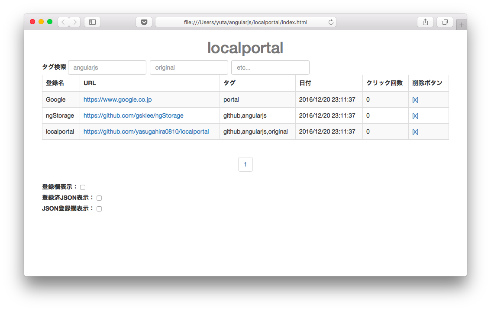

# v0.0.5 (2017/12/20リリース)

## 追加機能

- ページャー

## テーブル定義

変更なし（削除ボタンで意図しないリンクが削除される重大バグを修正）

## 説明

- ページャー機能を実装したことで、テーブルの下の登録欄表示などの要素がページ下部に行くことがなくなり、操作性が向上した。
- ドキュメント類（README.md, CHANGELOG.md）を整備した。

# v0.0.4 (2017/12/13リリース)

## 削除機能

- タグ選択

## テーブル定義

変更なし

## 説明

- v0.0.3でタグ選択を実装したが、タグが増えるとタグボタンで画面上部が埋め尽くされて目的のタグボタンが見つけづらいことに気づいたので、機能を削除。
- (再実装する場合には、ピックアップした少数のタグのみをタグボタンとして表示させるような実装にすべきと思う。)

# v0.0.3 (2017/12/10リリース)

## 追加機能

- テーブルのオンライン内容変更（登録名, タグ）
- タグ選択

## テーブル定義

カラム名 | 型
-----|-----
登録名|文字列
URL|**文字列**
タグ|**文字列**
日付|日付
クリック回数|数値

##　説明

- テーブルのオンライン内容変更の実装により、管理や検索のしやすさが向上した
- タグ選択により、タグ検索で文字を入力しなくともボタンでタグの絞り込みが可能になった(ただし選択できるタグは最大で3つまで)

# v0.0.2 (2016/11/27リリース)

## 追加機能

- タグ検索
- テーブルのソート順変更（登録名, URL, 日付, クリック回数）
- クリック回数カウント
- 登録済JSON表示
- JSON登録欄表示

## テーブル定義

カラム名 | 型
-----|-----
登録名|文字列
URL|URL
タグ|配列
日付|日付
クリック回数|数値

## 説明

- タグ検索の実装により、大量のリンクを管理しやすくなった（ただし検索できるタグは最大3つまで）
- テーブルのソート順変更の実装により、任意の順番でリンクをソートできるようになった
- クリック回数カウントとテーブルのソート順変更の実装により、使用頻度の高いリンクを上位に表示することが可能になった
- 登録済JSON表示、JSON登録欄表示の実装により、リンクのバックアップや別ブラウザへの移行がしやすくなった

# v0.0.1 (2016/11/06リリース)

## 追加機能

- リンクの登録
- リンクの削除

## テーブル定義

カラム名 | 型
-----|-----
登録名|文字列
URL|URL
日付|日付

## 説明

- リンクの登録、削除という最低限の機能が使える
