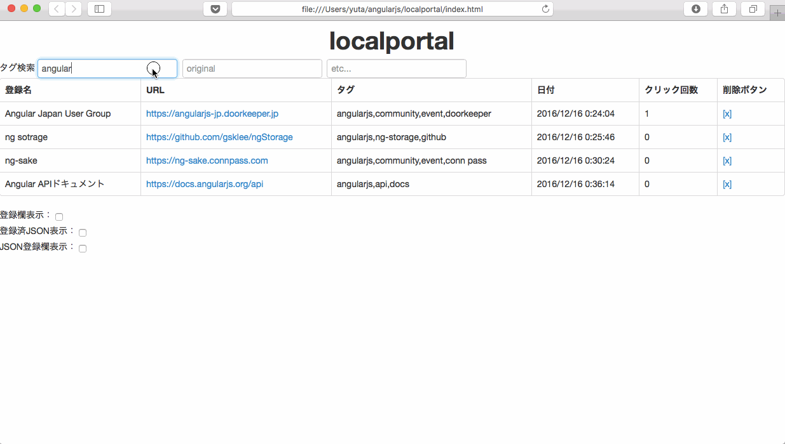

localportal
====

localportalは、HTML5のlocalstorageを使ったリンク集作成アプリです。  

## Description

- タグ機能により、ブラウザのブックマーク機能より容易にリンクの管理・検索ができます。
- またInternet Explorerでlocalportalを使うと、ファイルサーバのフォルダをブラウザから開くことができます。

## Demo

### リンク登録

### タグ検索

### タグ追加

## Requirement

## Usage

## Install

## Contribution

## Licence

localportal is released under the [MIT License](http://www.opensource.org/licenses/MIT).

## Author

[yasugahira0810](https://github.com/yasugahira0810)
