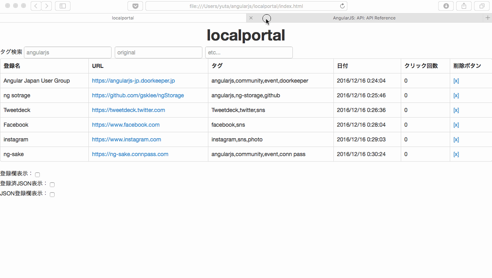
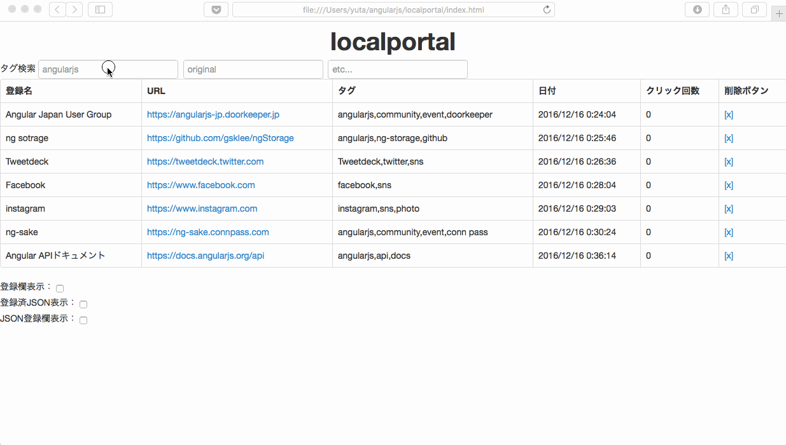
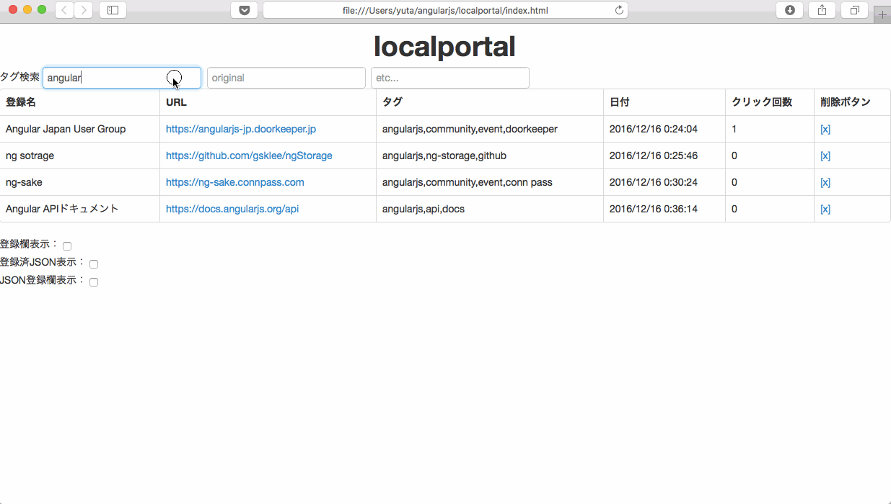

localportal
====

localportalは、**手軽に，検索しやすい形で**リンクを登録できるリンク集作成アプリです。  

## Description

- ブラウザからリンクの登録ができます。登録したリンクはlocalstorageに保存されます。
- タグ機能により、ブラウザのブックマーク機能より容易にリンクの管理・検索ができます。
- Windows上でInternet Explorerを使うと、ファイルサーバなどで使われるUNC表記のパス（例. ¥¥filesrv¥share¥）をブラウザから開くことができます。

## Demo

### 【デモ１】リンクの登録

localportalは、ブラウザからリンクを登録することができます。  
デモ１では、[AngularJS公式サイトのAPIドキュメントページ](https://docs.angularjs.org/api)をリンクとして登録しています。その際、登録名は「Angular APIドキュメント」、タグは「angularjs,api,docs」で登録しています。今回のリンクは公式サイトなので、「official」のタグがあった方が後で検索しやすいですが、ここでは設定しておりません。この後のデモ３で設定します。

*画像はv0.0.4時点*

---

### 【デモ２】タグ検索

localportalは、タグを指定してリンクを絞り込むことができます。  
デモ２では、リンクを「angularjs」、「event」、「doorkeeper」と絞り込み、Doorkeeperの「Angular Japan User Group」のページを開いています。

*画像はv0.0.4時点*

---

### 【デモ３】タグ追加

localportalは、登録済みリンクのタグを更新することができます。  
デモ３では、「リンクの登録」で登録したAngularJS公式サイトのAPIドキュメントページを「official」というタグで絞り込もうとしたところ、「official」がタグとして設定されておらず検索できなかったことから、登録済みのリンクに対して「official」のタグを追加してから検索をし直すというシナリオを実行しています。

*画像はv0.0.4時点*

---

## Requirement

ブラウザ以外は特になし

## Function

|項目|手順|
|---|---|
|リンクの登録|1.「登録欄表示」のチェックボックスにチェックをつける。 2.「登録名」「URL」「タグ」を入力して「Submit」をクリックする。|
|リンクの検索|1.「タグ検索」欄に文字列を入力する。 *※検索ワードは3つまで指定可能。*|
|リンクの削除|1. 削除対象のリンクの「削除ボタン」をクリックする。|
|リンクの編集|1. 編集対象のセルをダブルクリックする。 2. セルが編集可能になるので、編集する。 3. 編集対象のセル以外をクリックする。 *※編集可能なのは「登録名」と「タグ」のみ。*|
|ソート順変更|1. テーブルのカラム名をクリックする。 ※*ソート可能なのは「登録名」「URL」「日付」「クリック回数」のみ。* *※逆順ソートしたい場合はソート済みのカラム名をもう一度クリックする。*|
|リンクのバックアップ|1. 「登録済JSON表示」を表示して、表示されたJSONをコピーする。 2. テキストエディタを開いてコピーしたJSONをペーストする。|
|リンクの一括登録|1. 「リンクのバックアップ」で作成したJSONを「JSON登録欄表示」にペーストする。 ※*この機能はリンクのブラウザ間での共有や移行での利用を想定している。*|

## How to Use

### Online

[GitHub Pages](https://yasugahira0810.github.io/localportal)で最新のタグのlocalportalをご利用いただけます。（現在のバージョンはv0.0.7です。）  
localportalのアプリはオンラインで動きますが、リンクはローカルに保存されるので、リンクが流出することはありません。  
予告なくアプリを変更することがあるので、こまめにリンクのバックアップを取得することをお勧めします。

### Download

[GitHubのページ](https://github.com/yasugahira0810/localportal)からファイルをダウンロードして、「index.html」をブラウザで開いてください。  
データは各ブラウザのlocalstorageに保存されるので、データを保存するためにDBを準備する必要はありません。

## Contribution

GitHubでIssueを立てるかTwitter(yasugahira0810)でコメントを頂けると有難いです。

## Licence

localportal is released under the [MIT License](http://www.opensource.org/licenses/MIT).

## Author

[yasugahira0810](https://github.com/yasugahira0810)
